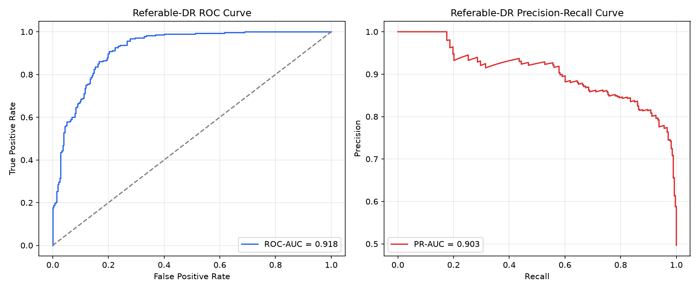
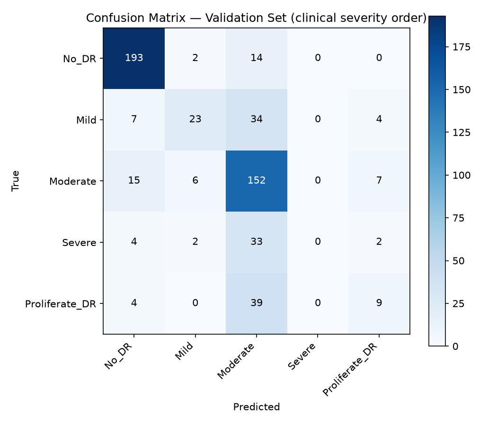

# Retinal Disease Detection AI

An end-to-end healthcare AI web application that detects diabetic retinopathy
from retinal fundus images using deep learning.


## Live Demo

[retina-ai-detection.onrender.com](https://retina-ai-detection.onrender.com)

---

## Sample Retina Images

Healthy Retina:
https://retina-ai-detection.onrender.com/static/sample_images/Healthy.png

Mild Diabetic Retinopathy:
https://retina-ai-detection.onrender.com/static/sample_images/Mild.png

Severe Diabetic Retinopathy:
https://retina-ai-detection.onrender.com/static/sample_images/Severe.png

## Overview

Diabetic retinopathy (DR) is a leading cause of blindness worldwide. Early
detection is critical. This project uses transfer learning with ResNet18 to
classify retinal images into five severity levels and generates Grad-CAM
heatmaps to explain model predictions — making the AI interpretable for
clinical use.

## Features

- Upload retinal fundus images via drag-and-drop web interface
- Five-class severity classification: No DR / Mild / Moderate / Severe / Proliferative
- Confidence score with visual probability bars for all classes
- Grad-CAM heatmap overlay showing which retinal regions influenced the prediction
- Medical disclaimer and responsible AI design

## Architecture

```
User uploads image
      │
      ▼
Flask backend (app.py)
      │
      ▼
Preprocessing pipeline (utils/preprocess.py)
  - Resize to 224×224
  - ImageNet normalisation
      │
      ▼
ResNet18 (transfer learning, fine-tuned final layer)
      │
      ├── Softmax → class probabilities + confidence
      │
      └── Grad-CAM → heatmap overlay
            │
            ▼
     Results rendered in browser
```

## Tech Stack

| Component | Technology |
|---|---|
| Deep learning | PyTorch 2.1, torchvision |
| Model | ResNet18 (transfer learning, ImageNet) |
| Explainability | Grad-CAM |
| Web framework | Flask 3.0 |
| Image processing | OpenCV, Pillow |
| Frontend | HTML5, CSS3, vanilla JavaScript |
| Dataset | Kaggle Diabetic Retinopathy (3662 images) |
| Deployment | Render (free tier) |

## Results

Evaluated with [`evaluate.py`](evaluate.py) on the held-out validation split
(550 images, the same 80/20 `random_split` with seed 42 that `train.py`
uses) — no retraining, just running the existing `model/retina_model.pth`
through inference. Raw numbers are in
[`evaluation_results.json`](evaluation_results.json).

This is a 5-class *ordinal* grading problem, but the metric that matters
most for a screening tool is simpler: **does the model catch anyone who
needs a referral?** Both views are below.

### Referable-DR screening

"Referable" = Moderate DR, Severe DR, or Proliferative DR (i.e. anything
beyond mild/no disease that should prompt an ophthalmology referral).
The operating threshold was chosen to hit at least 90% sensitivity.

| Metric | Value |
|---|---|
| Sensitivity @ threshold | 90.8% |
| Specificity @ threshold | 79.8% |
| ROC-AUC | 0.918 |
| PR-AUC | 0.903 |
| Operating threshold | 0.489 |
| Referable-DR prevalence (val set) | 49.6% |



### Ordinal grading performance

| Metric | Value |
|---|---|
| **Quadratic-weighted Cohen's kappa** | **0.675** |
| Overall accuracy (context only, not the primary metric) | 68.5% |

Quadratic-weighted kappa is computed against the true clinical severity
order (No DR &lt; Mild &lt; Moderate &lt; Severe &lt; Proliferative), not
the alphabetical index order the model was trained with — see the note
in [`utils/preprocess.py`](utils/preprocess.py) about `CLASS_NAMES`.

### Per-class precision / recall / F1

| Class | Precision | Recall | F1 | Support |
|---|---|---|---|---|
| No DR (Healthy) | 0.865 | 0.923 | 0.894 | 209 |
| Mild DR | 0.697 | 0.338 | 0.455 | 68 |
| Moderate DR | 0.559 | 0.844 | 0.673 | 180 |
| Severe DR | 0.000 | 0.000 | 0.000 | 41 |
| Proliferative DR | 0.409 | 0.173 | 0.243 | 52 |



**Honest take:** the minority severe classes are the weak point. Severe DR
(41 val images, only 190 in the whole dataset) is never correctly
identified as its own class — it's predicted mostly as Moderate DR instead
— and Proliferative DR recall is also low (17%). Both classes have the
least training data of the five, and their symptoms overlap heavily with
Moderate DR, which is where most of their misclassifications land. The
referable-DR screening numbers above look much better than the per-class
table because Moderate/Severe/Proliferative are grouped together for that
purpose, so a Severe case predicted as Moderate still correctly triggers a
referral — but as a 5-way grading tool, this model should not be trusted
to distinguish Severe from Proliferative DR without more data for those
classes.

| Reference | Value |
|---|---|
| Training epochs | 10 |
| Model size | ~45 MB |
| Inference time | ~0.3s (CPU) |

## Local Setup

```bash
# 1. Clone the repository
git clone https://github.com/Anurag-YadavIIH/retina-ai-detection.git
cd retina-ai-detection

# 2. Create and activate virtual environment
python -m venv venv
source venv/bin/activate        # Mac/Linux
venv\Scripts\activate           # Windows

# 3. Install dependencies
pip install -r requirements.txt

# 4. Download dataset (requires Kaggle API key)
kaggle datasets download -d sachinkumar413/diabetic-retinopathy-dataset
unzip diabetic-retinopathy-dataset.zip -d dataset/

# 5. Train the model
python train.py

# 6. Run the web app
python app.py
# Visit http://localhost:5000
```

## Dataset

Kaggle Diabetic Retinopathy Dataset by Sachin Kumar.
3662 retinal fundus images across 5 severity classes.
https://www.kaggle.com/datasets/sachinkumar413/diabetic-retinopathy-dataset

## Project Structure

```
retina-ai-detection/
├── app.py              Flask web server
├── train.py            Model training pipeline
├── predict.py          Inference + Grad-CAM
├── requirements.txt    Python dependencies
├── utils/
│   └── preprocess.py   Image transforms
├── templates/
│   └── index.html      Web interface
├── static/
│   └── style.css       Stylesheet
└── model/
    └── retina_model.pth  Trained weights (not in repo)
```

## Limitations and Future Work

- Dataset is relatively small (~3662 images); more data would improve accuracy
- Model is not clinically validated; not for medical use
- Future: add CLAHE preprocessing, ensemble models, patient data input form

## License

MIT License. See LICENSE file for details.

## Author

Anurag Yadav — [github.com/Anurag-YadavIIH](https://github.com/Anurag-YadavIIH/retina-ai-detection)
