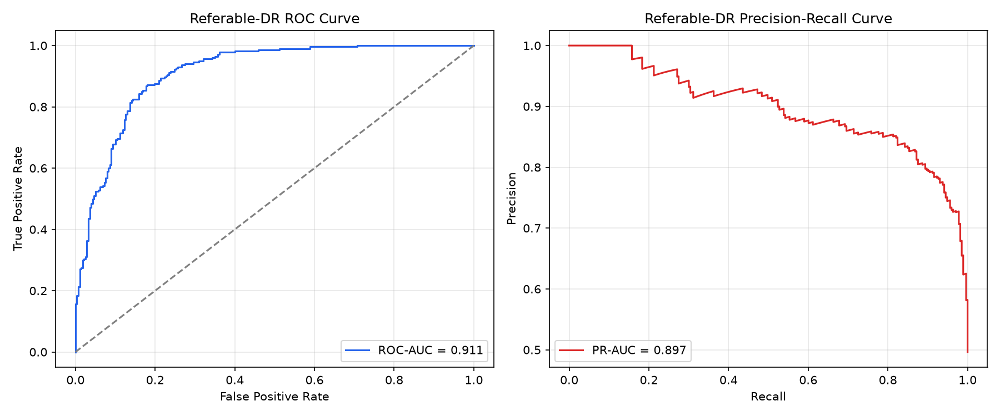
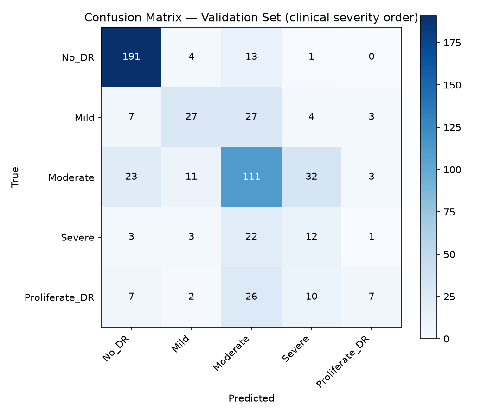
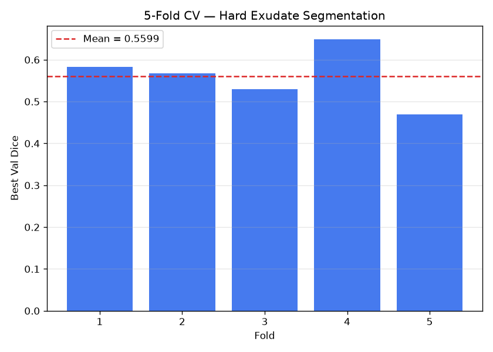
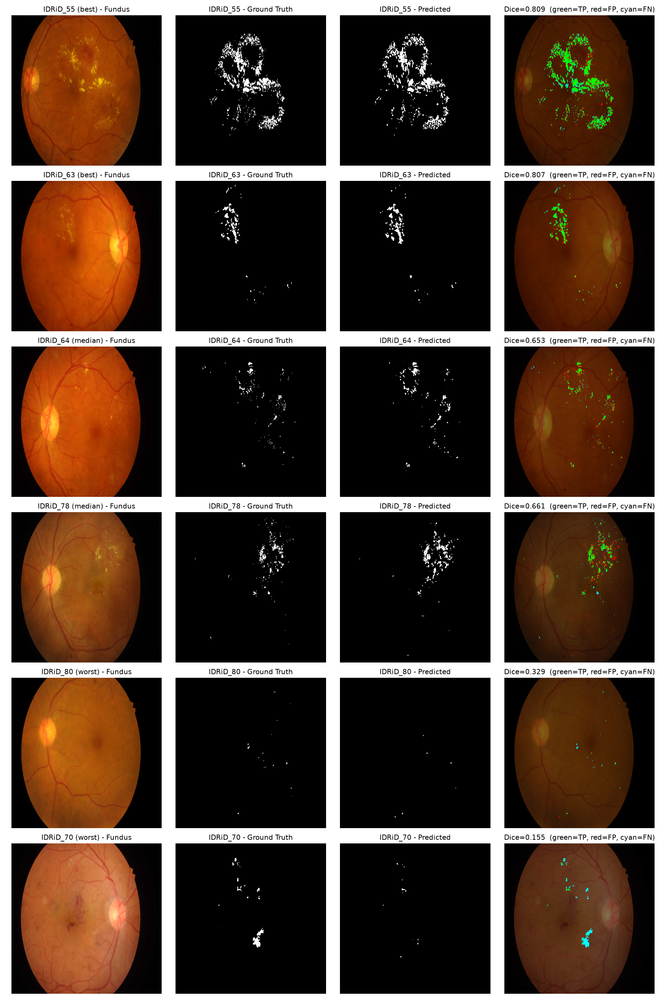

# Retinal Disease Detection AI

An end-to-end healthcare AI project with two capabilities built on retinal
fundus images: **diabetic retinopathy (DR) severity grading** with Grad-CAM
explainability, and **hard-exudate lesion segmentation**.


## Live Demo

[retina-ai-detection.onrender.com](https://retina-ai-detection.onrender.com)

**Note:** the deployed demo may lag behind this repo until it's redeployed.
Segmentation in particular needs `segmentation-models-pytorch` (just added to
`requirements.txt`) and the `model/exudate_unet_fold4.pth` checkpoint to be
present on the server — until a fresh deploy picks those up, the live demo
may only show DR grading + Grad-CAM, with the segmentation panel silently
absent (by design — see [Segmentation feature flag](#segmentation-feature-flag)).

---

## Sample Retina Images

Healthy Retina:
https://retina-ai-detection.onrender.com/static/sample_images/Healthy.png

Mild Diabetic Retinopathy:
https://retina-ai-detection.onrender.com/static/sample_images/Mild.png

Severe Diabetic Retinopathy:
https://retina-ai-detection.onrender.com/static/sample_images/Severe.png

## Overview

Diabetic retinopathy (DR) is a leading cause of blindness worldwide, and
early detection is critical. This project has two capabilities:

1. **DR severity grading** — five-class classification (No DR / Mild /
   Moderate / Severe / Proliferative) via transfer learning on ResNet18,
   with Grad-CAM heatmaps so predictions are explainable rather than a
   black box.
2. **Hard-exudate lesion segmentation** — a U-Net (ResNet34 encoder,
   ImageNet-pretrained, via `segmentation-models-pytorch`) trained on the
   IDRiD dataset to pixel-localize hard exudates, one specific DR lesion
   type. This is a newer, smaller-data capability than the classifier —
   see [Segmentation Results](#segmentation-results) for exactly how much
   data and how it was validated.

Segmentation is gated behind an `ENABLE_SEGMENTATION` environment variable
(defaults to `true`) and degrades gracefully: if it's set to `false`, the
checkpoint is missing, or anything in the segmentation path raises, the app
falls back to classifier + Grad-CAM only — segmentation never breaks the
core app. See [Segmentation feature flag](#segmentation-feature-flag).

## Features

- Upload retinal fundus images via drag-and-drop web interface
- Five-class DR severity classification with confidence score and
  per-class probability bars
- Grad-CAM heatmap overlay showing which retinal regions influenced the
  classifier's prediction
- Hard-exudate segmentation overlay showing predicted lesion pixels, plus
  lesion area as a percentage of the image (when segmentation is enabled)
- Medical disclaimer and responsible AI design, including an explicit note
  that segmentation covers hard exudates only

## Architecture

**DR severity grading:**

```
User uploads image
      │
      ▼
Flask backend (app.py)
      │
      ▼
Preprocessing pipeline (utils/preprocess.py)
  - Resize to 224×224
  - ImageNet normalisation
      │
      ▼
ResNet18 (transfer learning, fine-tuned final layer)
      │
      ├── Softmax → class probabilities + confidence
      │
      └── Grad-CAM → heatmap overlay
            │
            ▼
     Results rendered in browser
```

**Hard-exudate segmentation** (runs alongside the classifier, best-effort):

```
Same uploaded image
      │
      ▼
segmentation/seg_predict.py
  - Resize to 512×512 (bilinear), ImageNet normalisation
      │
      ▼
U-Net, ResNet34 encoder (segmentation_models_pytorch)
      │
      ▼
Sigmoid + threshold 0.5 → binary mask
      │
      ▼
Resize mask back to original resolution (nearest-neighbor — never
blur a binary mask) → semi-transparent overlay + lesion area %
```

## Tech Stack

| Component | Technology |
|---|---|
| DR classifier | ResNet18 (transfer learning, ImageNet), PyTorch 2.1 |
| Explainability | Grad-CAM |
| Segmentation model | U-Net, ResNet34 encoder (`segmentation-models-pytorch`) |
| Web framework | Flask 3.0 |
| Image processing | OpenCV, Pillow |
| Frontend | HTML5, CSS3, vanilla JavaScript |
| Classifier dataset | Kaggle Diabetic Retinopathy (3662 images) |
| Segmentation dataset | IDRiD Segmentation subset (81 images, hard exudates) |
| Deployment | Render (free tier) |

## Classifier Results

Evaluated with [`evaluate.py`](evaluate.py) on the held-out validation split
(550 images, the same 80/20 `random_split` with seed 42 that `train.py`
uses). Two checkpoints were evaluated this way — `model/retina_model.pth`
(baseline) and `model/retina_model_weighted.pth` (class-weighted loss) — and
their raw numbers are in [`evaluation_results.json`](evaluation_results.json)
and [`evaluation_results_weighted.json`](evaluation_results_weighted.json)
respectively.

**The weighted model is what's deployed** (`predict.py`'s `MODEL_PATH`).
See [Class-imbalance experiment](#class-imbalance-experiment-baseline-vs-weighted-loss)
below for why.

### Why not accuracy?

DR grading is a 5-class *ordinal* problem with a heavily imbalanced class
distribution — most images are No DR or Moderate, and Severe/Proliferative
are rare. Plain accuracy rewards a model for doing well on the majority
classes while ignoring the rare, clinically urgent ones (a model that never
once predicts Severe DR can still post a respectable accuracy number). So
this project reports **referable-DR sensitivity/specificity, ROC-AUC,
PR-AUC**, and **quadratic-weighted Cohen's kappa** (the standard metric for
ordinal DR grading) as the primary results, with accuracy included only as
supporting context.

### Referable-DR screening (deployed model: weighted)

"Referable" = Moderate DR, Severe DR, or Proliferative DR (i.e. anything
beyond mild/no disease that should prompt an ophthalmology referral). The
operating threshold was chosen to hit at least 90% sensitivity.

| Metric | Value |
|---|---|
| Sensitivity @ threshold | 90.1% |
| Specificity @ threshold | 77.3% |
| ROC-AUC | 0.911 |
| PR-AUC | 0.897 |
| Operating threshold | 0.519 |
| Referable-DR prevalence (val set) | 49.6% |



### Ordinal grading performance (deployed model: weighted)

| Metric | Value |
|---|---|
| **Quadratic-weighted Cohen's kappa** | **0.653** |
| Overall accuracy (context only, not the primary metric) | 63.3% |

Quadratic-weighted kappa is computed against the true clinical severity
order (No DR &lt; Mild &lt; Moderate &lt; Severe &lt; Proliferative), not
the alphabetical index order the model was trained with — see the note
in [`utils/preprocess.py`](utils/preprocess.py) about `CLASS_NAMES`.

### Per-class precision / recall / F1 (deployed model: weighted)

| Class | Precision | Recall | F1 | Support |
|---|---|---|---|---|
| No DR (Healthy) | 0.827 | 0.914 | 0.868 | 209 |
| Mild DR | 0.574 | 0.397 | 0.470 | 68 |
| Moderate DR | 0.558 | 0.617 | 0.586 | 180 |
| Severe DR | 0.203 | 0.293 | 0.240 | 41 |
| Proliferative DR | 0.500 | 0.135 | 0.212 | 52 |



**Honest take:** class-weighting fixed the worst failure (Severe DR going
completely undetected) but didn't make the model uniformly better — it's a
genuine tradeoff, not a free win. No DR, Mild DR, and especially Moderate DR
(F1 0.673 → 0.586) all got a bit worse, and Proliferative DR recall actually
dropped slightly too (17.3% → 13.5%). Severe and Proliferative DR remain the
weakest classes by a wide margin, which tracks with them having the least
training data (Severe: 190 images, Proliferative: 290, vs. 900–1000 for
Moderate/No DR) and symptom overlap with Moderate DR. As a 5-way grading
tool this model still shouldn't be trusted to reliably distinguish Severe
from Proliferative DR.

### Class-imbalance experiment: baseline vs. weighted loss

The baseline model was trained with plain `CrossEntropyLoss`. Because
Severe DR and Proliferative DR are the rarest classes in the training data,
the baseline learned to essentially never predict Severe DR at all — a
structural blind spot on one of the two most urgent grades. `train.py` was
updated to compute inverse-frequency class weights from the training set
and pass them into `CrossEntropyLoss(weight=...)` (see
[`train.py`](train.py)); everything else (architecture, epochs, learning
rate, split, seed) was held constant so class weighting was the only
variable.

| Metric | Baseline | Weighted | Change |
|---|---|---|---|
| Overall accuracy | **68.6%** | 63.3% | worse |
| Quadratic-weighted kappa | **0.675** | 0.653 | worse |
| Severe DR F1 | 0.000 | **0.240** | fixed |
| Referable-DR sensitivity | 90.8% | 90.1% | ~unchanged |
| Referable-DR specificity | 79.8% | 77.3% | slightly worse |

The baseline scores higher on accuracy and marginally higher on kappa, but
it never predicted Severe DR as a class at all (F1 0.000) — every single
Severe DR case was misclassified as something else. The weighted model
detects Severe DR (F1 0.240) at essentially unchanged referable-DR
sensitivity (90.1% vs. 90.8% — both comfortably above the 90% target).
**For a screening tool, eliminating a structural blind spot on an urgent
grade outweighs a small aggregate-metric cost**, which is why the weighted
model is the one deployed, despite losing on the aggregate numbers.

| Reference | Value |
|---|---|
| Training epochs | 10 |
| Model size | ~45 MB |
| Inference time | ~0.3s (CPU) |

## Segmentation Results

Hard-exudate segmentation, trained and evaluated on the
[IDRiD Segmentation subset](https://idrid.grand-challenge.org/) — 54 training
images, 27 held-out test images, hard exudates only (not microaneurysms,
haemorrhages, or soft exudates). Full pipeline: `segmentation/seg_dataset.py`
(data), `seg_model.py` (U-Net), `seg_losses.py` (BCE+Dice), `seg_train.py` /
`seg_train_kfold.py` (training), `seg_evaluate_test.py` (final evaluation).

### 5-fold cross-validation

The 54 training images were split 5-fold (`sklearn.model_selection.KFold`,
shuffled, seed 42), training a fresh U-Net per fold (max 100 epochs, early
stopping at 15 epochs without val-dice improvement):

| Metric | Value |
|---|---|
| **Dice** | **0.560 ± 0.059** |
| IoU | 0.407 ± 0.053 |



### Held-out test set (evaluated once)

The best-performing fold (Fold 4, val dice 0.649) was evaluated exactly once
on the 27-image IDRiD test set — untouched by any training or model
selection:

| Metric | Value |
|---|---|
| Mean Dice | 0.628 |
| Median Dice | 0.653 |
| Mean IoU | 0.475 |
| Best single image | Dice 0.809 |
| Worst single image | Dice 0.155 |



**Honest take — failure modes:** performance is uneven across images (best
0.809, worst 0.155), and the qualitative figure above shows why: the
dominant failure mode is **under-detection of faint or diffuse exudate
clusters**, not false positives painted onto clean retinas. This mirrors the
classifier's own weakness on rare severe grades — both models are better at
confirming an obvious finding than catching a subtle one. For a screening
aid, that asymmetry matters: a missed lesion (false negative) is a more
dangerous failure than a spurious one (false positive), since the former
means a real finding goes unflagged entirely.

**Methodology note — why 5-fold CV instead of a single split:** two early
training runs with a single 45/9 train/val split and "identical"
hyperparameters produced val dice of **0.628 and 0.526** — a 10-point swing
from run-to-run noise alone (unseeded randomness in decoder initialization,
augmentation, and batch ordering), which meant a single 9-image validation
split had error bars too wide to trust one number from. `seg_train.py` was
updated to fully seed every source of randomness (Python `random`, NumPy,
`torch`, `torch.cuda`, plus deterministic cuDNN), and `seg_train_kfold.py`
runs 5 independent folds to report a mean ± std rather than a single
point estimate.

**Data-quality note:** one test mask, `IDRiD_81_EX.tif`, is stored as RGBA
rather than palette-indexed like the other 26 test masks (a pre-existing
inconsistency in the IDRiD dataset itself). `seg_dataset.py` detects and
handles both encodings — see the comment in `IDRiDExudateDataset.__getitem__`.

## Limitations

- **Classifier:** trained on ~3662 images; Severe and Proliferative DR
  remain the weakest classes even after class weighting (see above).
- **Segmentation:** only 54 training images total; hard exudates only (does
  not detect microaneurysms, haemorrhages, or soft exudates); 512×512
  input resolution was chosen to fit a 4GB GPU (GTX 1050), which limits
  fidelity on very small lesions relative to the original ~4288×2848
  fundus images.
- Neither model is clinically validated. **This is not a medical device**
  and must not be used for clinical diagnosis.

## Local Setup

```bash
# 1. Clone the repository
git clone https://github.com/Anurag-YadavIIH/retina-ai-detection.git
cd retina-ai-detection

# 2. Create and activate virtual environment
python -m venv venv
source venv/bin/activate        # Mac/Linux
venv\Scripts\activate           # Windows

# 3. Install dependencies (includes segmentation-models-pytorch)
pip install -r requirements.txt

# 4. Download the DR classification dataset (requires Kaggle API key)
kaggle datasets download -d sachinkumar413/diabetic-retinopathy-dataset
unzip diabetic-retinopathy-dataset.zip -d dataset/

# 5. Train the classifier
python train.py

# 6. Run the web app
python app.py
# Visit http://localhost:5000
```

### Segmentation setup (optional)

1. Download the **Segmentation** subset ("A. Segmentation") from the
   [IDRiD grand-challenge site](https://idrid.grand-challenge.org/) —
   there's no CLI download for this one, it's a manual download.
2. Point `DATA_ROOT` in [`segmentation/seg_dataset.py`](segmentation/seg_dataset.py)
   at wherever you extracted it.
3. Train with 5-fold cross-validation:
   ```bash
   python segmentation/seg_train_kfold.py
   ```
   This trains 5 folds (up to 100 epochs each, early stopping patience 15)
   and saves `model/exudate_unet_fold{1..5}.pth` plus
   `segmentation/kfold_results.json` / `kfold_summary.png`.
4. Run the final, one-time held-out test evaluation on whichever fold
   scored best:
   ```bash
   python segmentation/seg_evaluate_test.py
   ```
5. `app.py` loads `model/exudate_unet_fold4.pth` by default (the
   best-performing fold from this project's own run — edit
   `CHECKPOINT_PATH` in `segmentation/seg_predict.py` if your best fold
   differs).

#### Segmentation feature flag

Set `ENABLE_SEGMENTATION=false` to disable the segmentation panel entirely
(classifier + Grad-CAM keep working normally):

```bash
# PowerShell
$env:ENABLE_SEGMENTATION="false"; python app.py

# bash
ENABLE_SEGMENTATION=false python app.py
```

Segmentation also disables itself automatically (no crash, no broken UI) if
the checkpoint file is missing or loading/inference raises for any reason.

## Datasets

- **DR classification:** [Kaggle Diabetic Retinopathy Dataset](https://www.kaggle.com/datasets/sachinkumar413/diabetic-retinopathy-dataset)
  by Sachin Kumar. 3662 retinal fundus images across 5 severity classes.
- **Hard-exudate segmentation:** [IDRiD](https://idrid.grand-challenge.org/)
  ("A. Segmentation" subset) — 81 fundus images (54 train / 27 test) with
  pixel-level lesion annotations. This project uses the Hard Exudates
  annotations only.

## Project Structure

```
retina-ai-detection/
├── app.py                     Flask web server
├── train.py                   Classifier training pipeline (weighted loss)
├── predict.py                 Classifier inference + Grad-CAM
├── evaluate.py                Classifier evaluation (referable-DR, kappa, etc.)
├── requirements.txt           Python dependencies
├── utils/
│   └── preprocess.py          Classifier image transforms, class metadata
├── segmentation/
│   ├── seg_dataset.py         IDRiDExudateDataset
│   ├── seg_model.py           U-Net builder (segmentation_models_pytorch)
│   ├── seg_losses.py          Dice / BCE+Dice loss, dice & IoU metrics
│   ├── seg_train.py           Single-split trainer + shared training loop
│   ├── seg_train_kfold.py     5-fold cross-validation trainer
│   ├── seg_evaluate_test.py   Final held-out test evaluation
│   └── seg_predict.py         Flask inference wrapper (cached model, feature flag)
├── templates/
│   └── index.html             Web interface (3-panel results: original / Grad-CAM / exudates)
├── static/
│   └── style.css               Stylesheet
└── model/
    ├── retina_model.pth              Baseline classifier (not in repo)
    ├── retina_model_weighted.pth     Deployed classifier, class-weighted (not in repo)
    └── exudate_unet_fold4.pth        Deployed segmentation model (in repo)
```

## License

MIT License. See LICENSE file for details.

## Author

Anurag Yadav — [github.com/Anurag-YadavIIH](https://github.com/Anurag-YadavIIH/retina-ai-detection)
